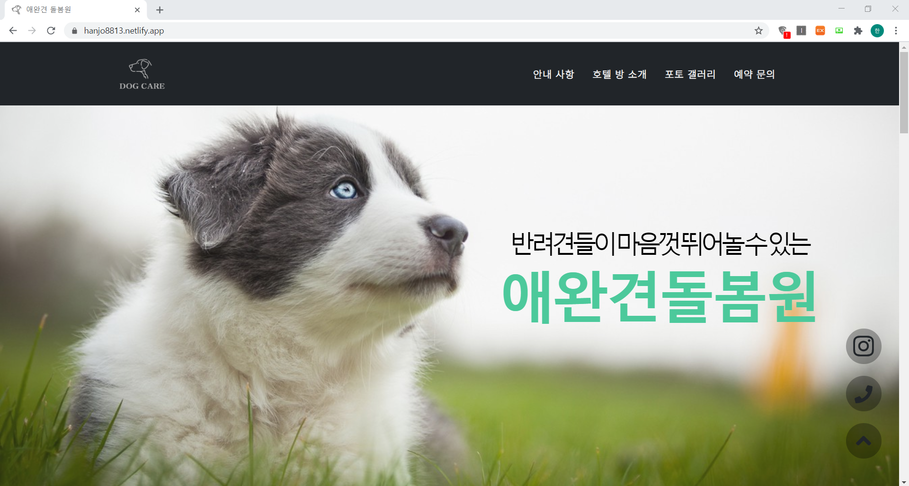

# < 프론트엔드 프로젝트 >

https://hanjo8813.netlify.app
### 프론트엔드 영역을 디자인하여 정적 사이트를 구현한 프로젝트입니다.

## 소개

1. 실존하는 애견호텔의 사이트를 구현하였습니다.
2. 백엔드 기능을 제외한 프론트엔드 영역만을 디자인하였습니다.
3. Netlify의 무료 도메인을 사용하여 Git Hub와 연동 후 온라인 배포하였습니다.
4. 지도는 카카오 맵 API를 사용하였습니다.
5. 반응형 웹으로 디자인되지 않아 디바이스 최적화는 풀어야할 과제입니다.
6. 사용된 라이브러리는 Bootstrap과 W3 입니다.
7. 아래는 참고한 템플릿과 사이트 링크입니다.

https://startbootstrap.com/previews/agency
https://www.w3schools.com/w3css/default.asp
